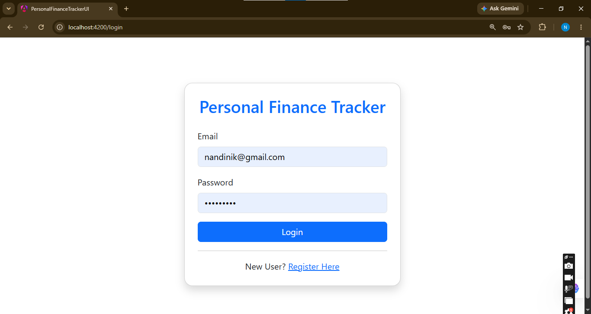
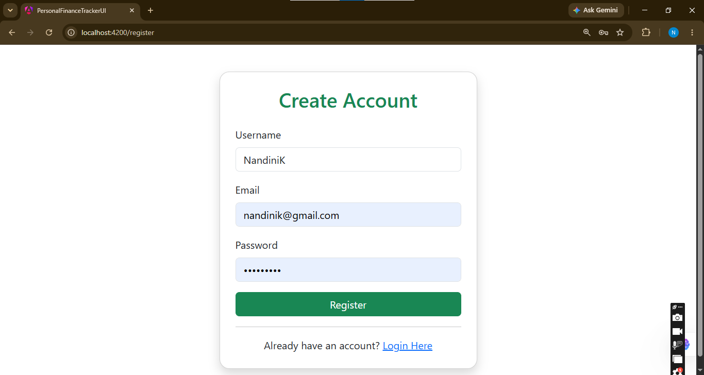
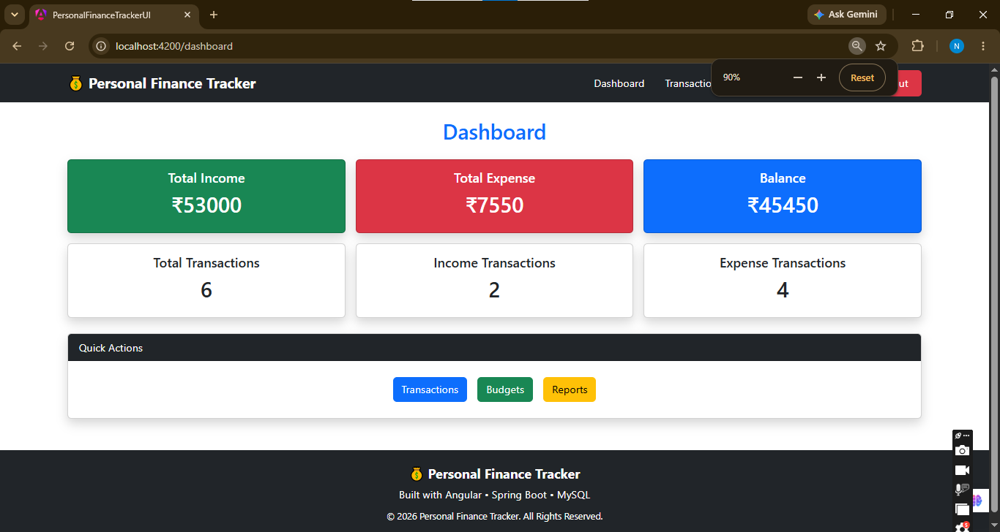
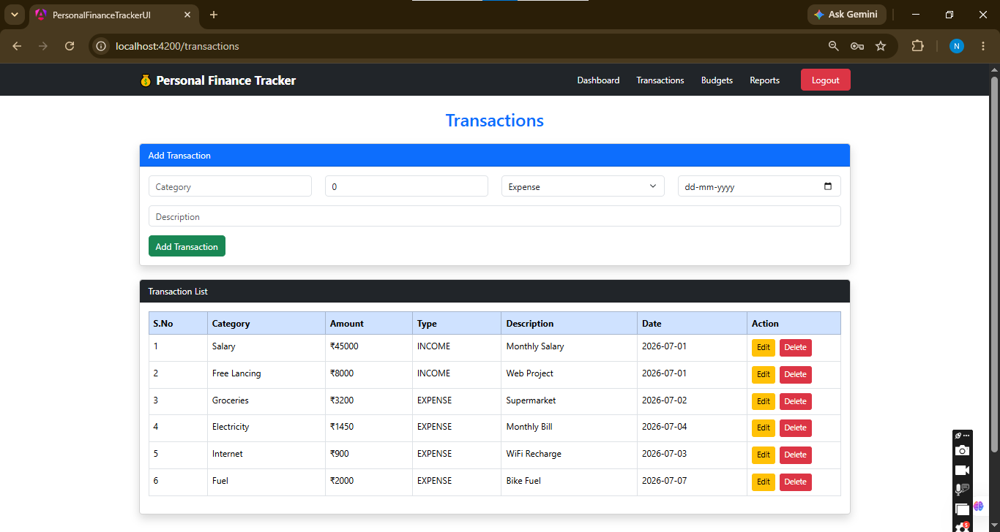
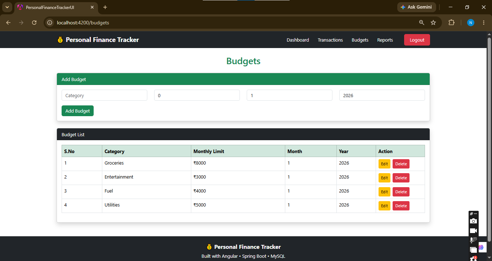
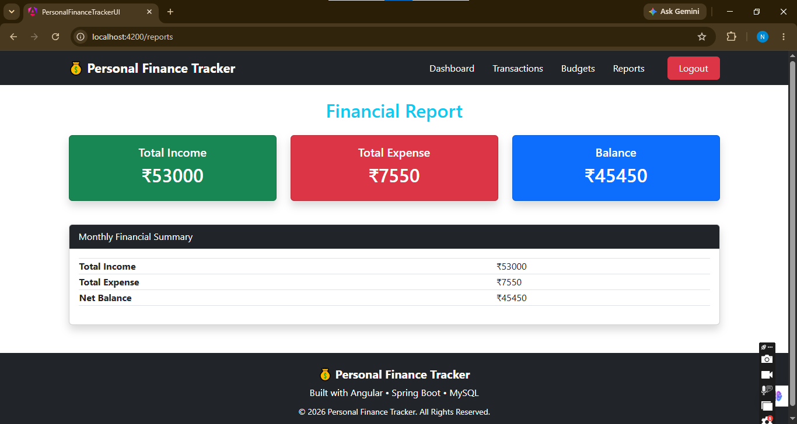

# 📸 Application Screenshots

## 🔐 Login



---

## 📝 Register



---

## 📊 Dashboard



---

## 💳 Transactions



---

## 💰 Budgets



---

## 📈 Reports

- Budget Management
- Financial Reports
- Responsive Navigation Bar
- Responsive Footer
- Form Validation
- Empty State Messages

---

## 🛠 Technology Stack

- Angular
- TypeScript
- Bootstrap 5
- HTML5
- CSS3
- RxJS
- REST API

---

## 📂 Project Structure

```text
src
├── app
│   ├── components
│   ├── guards
│   ├── interceptors
│   ├── services
│   └── app.routes.ts
```

---

## 🔐 Authentication Flow

1. User logs in.
2. Backend returns a JWT token.
3. Token is stored in Local Storage.
4. HTTP Interceptor attaches the token to every API request.
5. Route Guard protects authenticated pages.

---

## 📱 Application Modules

- Login
- Register
- Dashboard
- Transactions
- Budgets
- Reports

---

## 🎨 UI Features

- Bootstrap Responsive Design
- Responsive Navbar
- Footer
- Form Validation
- Mobile Friendly Layout

---

## ⚙️ Installation

1. Clone the repository

```bash
git clone <repository-url>
```

2. Install dependencies

```bash
npm install
```

3. Run the application

```bash
ng serve
```

4. Open

```text
http://localhost:4200
```

---

## 🔗 Backend

This project connects to the Spring Boot Backend through REST APIs secured using JWT Authentication.

---

## 🚀 Future Enhancements

- Dark Mode
- Charts & Analytics
- Export Reports
- User Profile
- Notifications

---

## 👩‍💻 Author

**Nandini Karjala**

Java Full Stack Developer
